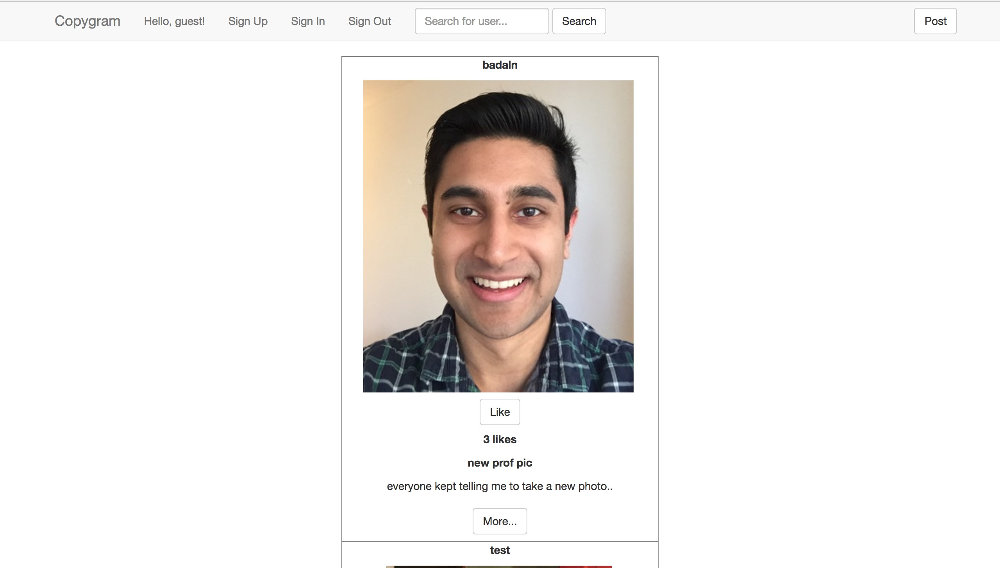

# Copygram

### Description:
An instagram-like application made using Ruby on Rails. The application uses AWS S3 to store images. Users can sign up, log in, and log out. There is a main 'wall' containing all posts. Users can also search for other users by user name, like/unlike posts, and create/edit/delete their own posts. 

### Run Instructions:
Make sure Ruby and Rails are both installed. Navigate to main directory in the terminal and use the 'rails server' command. Open a web browser and go to localhost:3000.

### Notes:
-IMPORTANT! This application uses AWS S3 to store images. You will need to add bucket name, access key, and secret key to the development.rb file located in config/environments.

-Sometimes it can take a bit to upload/load images depending on how fast S3 is.
