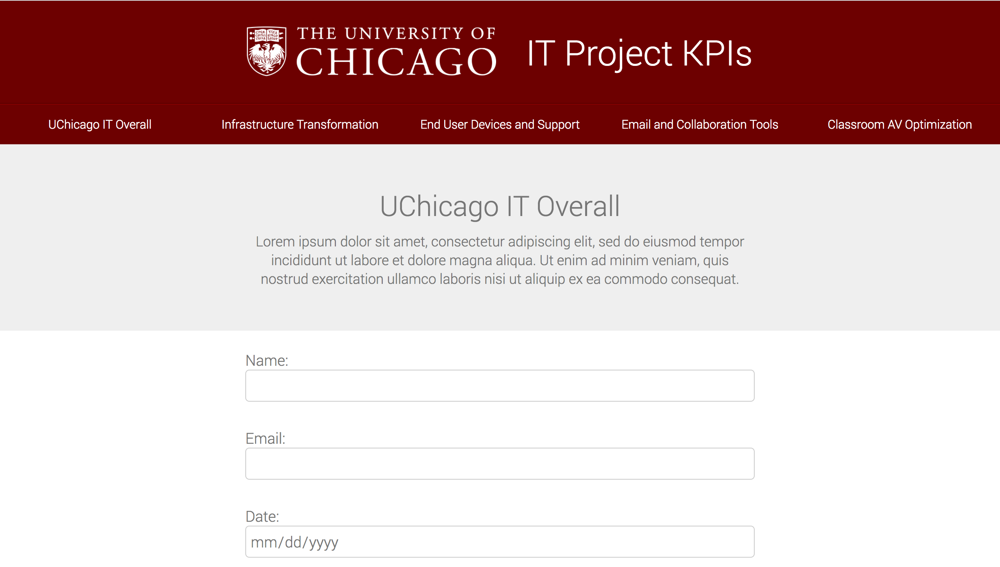

# UChicago ITS Form Skeleton

### Description:
An html form showcasing pure HTML and CSS. No libraries, frameworks, or javascript were used intentionally.

### Run Instructions:
Download this respository and open the .html file with any web browser.

### Notes:
Form was created for University of Chicago IT Services as a wireframe.