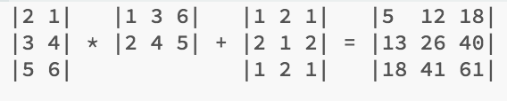

# MIPS Matrix Multiplication and Addition

Program computes matrix multiplication/addition shown above.

### Description:
Computes the multiplication of 3x2 and 2x3 matrices A and B (which contain floating point values) using the MIPS Assembly Language. This yields a 3x3 matrix. The result is then added with matrix C, which is 3x3.

### Run Instructions:
Download MARS MIPS simulator or qtSPIM and load matrixMult.asm. Replace the paths of the input files with absolute paths. Run the file. D.out will contain the output.

### Notes:
-Matrix A (3x2) (row major) is input in the binary file as 2, 1, 3, 4, 5, 6. Every 2 numbers represent one row.

-Matrix B (2x3) (row major) is input in the binary file as 1, 2, 3, 4, 6, 5. Every 2 numbers represent one column.

-Matrix C (3x3) (row major) is input as 1, 2, 1, 2, 1, 2, 1, 2, 1. Every 3 numbers represents one row.

-Matrix D (3x3) (row major) was output as 5.0, 12.0, 18.0, 13.0, 26.0, 40.0   18.0, 41.0, 61.0. Every 3 numbers represents one row.

|2 1|   |1 3 6|   |1 2 1|   |5  12 18|
|3 4| * |2 4 5| + |2 1 2| = |13 26 40|
|5 6|             |1 2 1|   |18 41 61|

-Again, you need to provide absolute paths to all the input files in matrixMult.asm.
