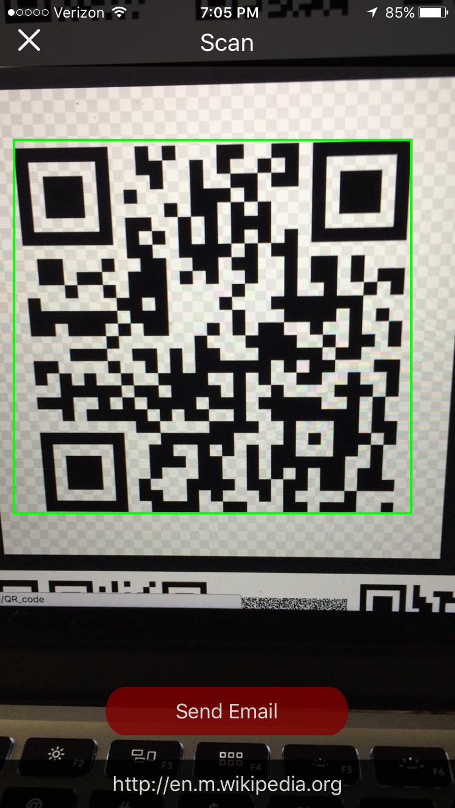

# Tic-Tac-Toe

### Description:
A QR code reader application for UChicago ITS technicians. After they are done with maintainence, they scan the QR code outside the room. The QR code contains important room information. The technician can easily send this over email to confirm servicing is completed.

### Run Instructions:
Download/clone repository. Open QRCodeReader.xcworkspace file in QRCodeReader/ folder with XCode. Run application on a selected target.