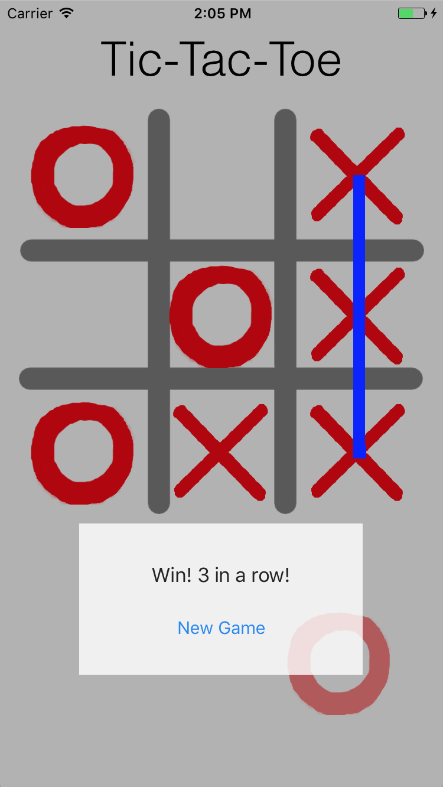

# Tic-Tac-Toe

### Description:
A 2-player tic-tac-toe iOS game made using Swift. The application has game logic, animations, drag/drop functionality, and sound effects.

### Running Instructions:
Download/clone repository. Open TicTacToe/TicTacToe folder with XCode. Run on a selected target.

### Notes:
After winning or getting to a stalemate on first game, the Xs and Os fly in from the left.

### Attributions: 
For growing animation - http://jamesonquave.com/blog/category/swift-3/