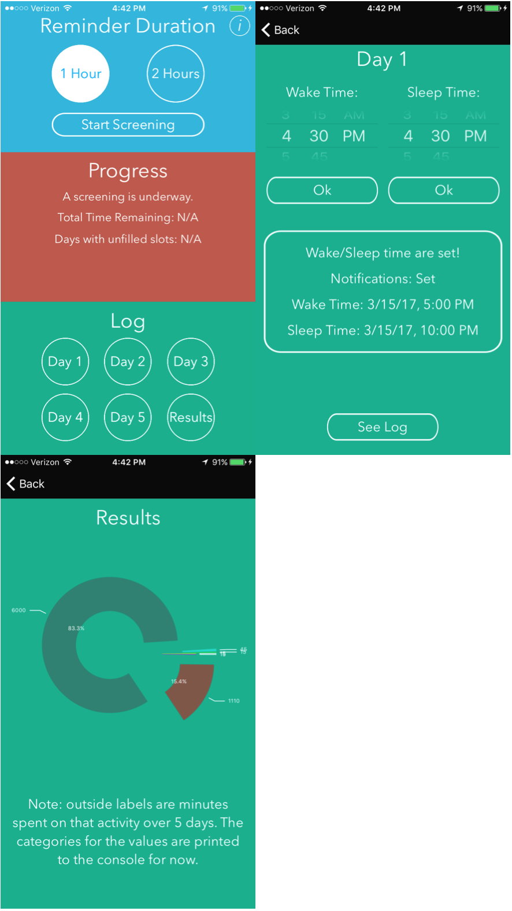

# Where Does the Time Go?

### Description
Tested for iPhone 6 & 7.

WhereDoesTheTimeGo is a time logging application. It works over 5 days and helps you record what you are doing every waking moment. It then presents you with you results in a pie chart. Set your wake and sleep times and then press See Log to enable notifications. Then click out of the app and come back to fill in the slots as needed.

### Run Instructions:
Download/clone repository. Open WhereDoesTheTimeGo.xcworkspace file in WhereDoesTheTimeGo/WhereDoesTheTimeGo folder with XCode. Run application on a selected target.

### Features:
-2 second splash screen

-Set your predicted waking and sleep hours for 5 days (only set the next days times after finishing the previous day)

-App will calculate the hours you are up and send notifications during them

-Results presented with PieCharts library. The number outside the doughnut is minutes, inside is %

-Information button

-Colorful interface

-Drag and drop 15 minute increments

-Notifications every 1 or 2 waking hours

-Time logging for 5 days

### Note:
-Please don't set your wake time after your sleep time, the app wants you to predict when you will wake up the next day

-The application assumes you wake up and go to bed during the same day. Example: it doesn't yet account for bed times after midnight

-Only go to the next day and set you predicted wake and sleep times after you have completely filled the previous day's log, otherwise notifications will be set twice. In the future I will lock the next day until the previous day is completed

-The pie chart doesn't yet display the labels for each minute and % value. They are printed to the console for now

-Hours on tableview are shown in military time currently
    
    
    
    
